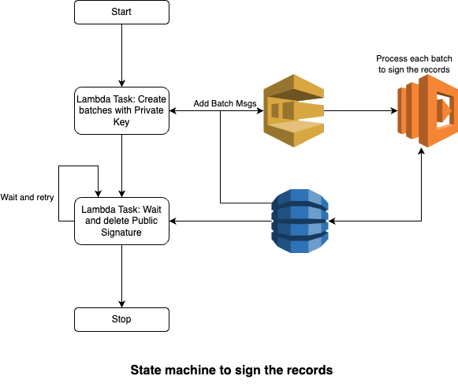

# Welcome to Record Signer
This repository creates resources to sign the user records using private keys.

## Design



## Steps to run a project

1. Setup a AWS CLI by following: https://cdkworkshop.com/15-prerequisites/200-account.html#configure-your-credentials
1. Install CDK CLI by following: https://docs.aws.amazon.com/cdk/v2/guide/cli.html
1. Install Python and Pip by following: https://packaging.python.org/en/latest/tutorials/installing-packages/
1. Download or clone the repository and move to directory.
1. Run following CDK Commands -
    ```
    cdk bootstrap
    cdk deploy 
    ```
    This should create resources in your configured AWS account and region e.g. SQS Queue, DDB Tables, Lambda Functions, CFN Stack, etc.
1. Install python packages -
    ```
    pip3 install boto3
    pip3 install cryptography
    ```
1. Run following commands to generate data -
    ```
    python3 data_generator/generate_private_keys.py
    python3 data_generator/generate_ddb_records.py
    ```
1. Now, goto AWS Console -> Lambda Functions -> Select `Batch Creator` and test function. This should create batches and SQS events. Which will trigger the job for signing the records.
1. Verification: Goto Dynamo Console and check `records-public-keys` table. It should have public user data with signature. Also, you can find log groups for lambda functions to verify details about the processing.

## Useful commands

* `npm run build`   compile typescript to js
* `npm run watch`   watch for changes and compile
* `npm run test`    perform the jest unit tests
* `cdk deploy`      deploy this stack to your default AWS account/region
* `cdk diff`        compare deployed stack with current state
* `cdk synth`       emits the synthesized CloudFormation template
